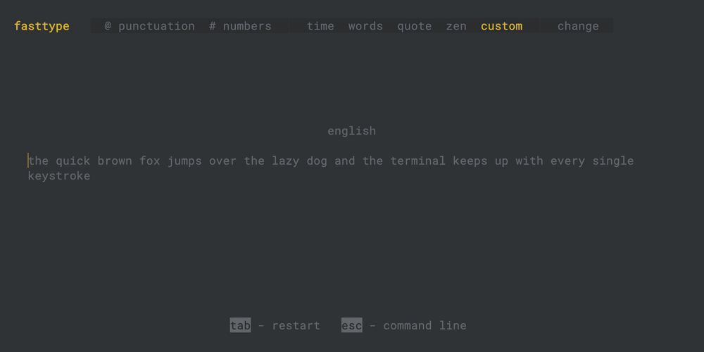
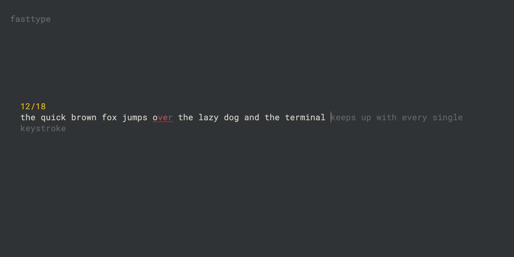
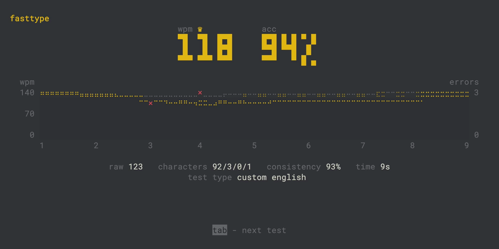
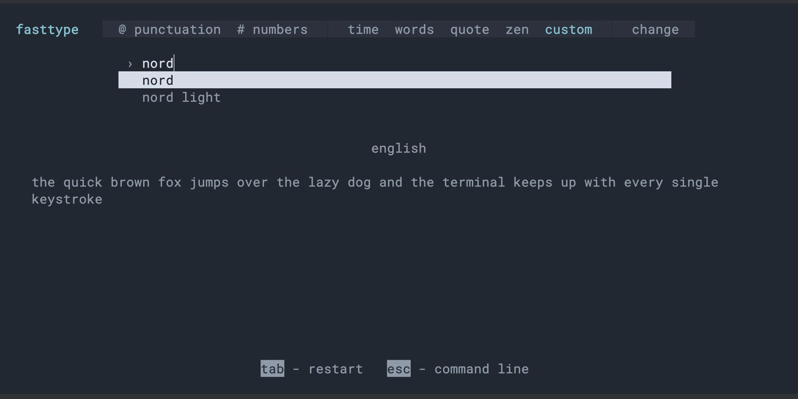

# fasttype

Monkeytype dans le terminal : mêmes modes, mêmes calculs, mêmes thèmes, mêmes animations, tout hors ligne.



| Pendant le test | Résultat | Palette et thèmes |
|---|---|---|
|  |  |  |

- Modes `time`, `words`, `quote`, `zen` et `custom`, avec ponctuation et nombres.
- Les langues, citations et thèmes de Monkeytype, embarqués dans le binaire.
- wpm, raw, précision, régularité et graphique calculés comme sur le site ; records et historique enregistrés en local.
- Palette de commandes (`esc`) avec tous les réglages, et aperçu des thèmes en direct.
- Caret qui glisse au pixel près et mots en grand dans Kitty et Ghostty.

## Installer

Télécharger l'archive de sa plateforme dans les [releases](https://github.com/freezer71/fasttype/releases/latest) (Linux, macOS, Windows), l'extraire et lancer `fasttype`.

Sur macOS, si le système bloque le binaire téléchargé : `xattr -d com.apple.quarantine fasttype`.

Depuis les sources (Rust 1.97 ou plus récent) :

```sh
cargo install --git https://github.com/freezer71/fasttype fasttype-tui
```

## Lancer depuis les sources

```sh
cargo run --release -p fasttype-tui            # depuis la racine du projet
cargo run --release -p fasttype-tui -- --perf  # avec la latence touche → écran
```

Pour installer la commande `fasttype` : `cargo install --path crates/fasttype-tui`.

Options :

| Option | Effet |
|---|---|
| `--perf` | affiche la latence et le temps d'image, et un résumé à la sortie |
| `--fps 60\|120\|144` | cadence des animations (60 par défaut) |
| `--rebuild-pbs` | recalcule les records depuis l'historique |
| `--version`, `--help` | |

## Touches

| Touche | Effet |
|---|---|
| `tab` | nouveau test (réglable dans la palette : `quick restart`) |
| `esc` ou `ctrl+shift+p` | palette de commandes : tous les réglages, thèmes, langues, citations, texte custom… |
| `shift+enter` | termine un test zen |
| `ctrl+backspace`, `alt+backspace`, `ctrl+w` | efface le mot |
| `ctrl+c` | quitter |

Dans la palette : `↑`/`↓` (ou `ctrl+k`/`ctrl+j`, `tab`/`shift+tab`) pour se déplacer, `enter` pour choisir, `esc` pour revenir.

## Terminaux

- **Kitty (0.40 ou plus récent)** : caret au pixel près, et mots en grand avec la police du terminal (réglage `font size`, 2 par défaut comme sur le site).
- **Ghostty** : caret au pixel près, et mots en grand dessinés en images avec la police du site (Roboto Mono). Les écritures que Roboto Mono ne couvre pas (chinois, japonais, hébreu…) restent à la taille du terminal. WezTerm devrait se comporter de même, sans être vérifié.
- **Autres terminaux** (iTerm2, Alacritty, Terminal.app…) : caret du terminal. Pour agrandir le texte, zoomer dans le terminal (`cmd +`).

`FASTTYPE_CARET=cell` ou `FASTTYPE_CARET=kitty` force le rendu du caret.

## Fichiers

| Fichier | Contenu |
|---|---|
| `~/.config/fasttype/config.toml` | réglages (toutes les clés de Monkeytype, en `snake_case`) |
| `~/.local/share/fasttype/results.jsonl` | historique des tests |
| `~/.local/share/fasttype/personal_bests.json` | records |
| `~/.local/share/fasttype/custom_texts/` | textes custom |

Les variables `XDG_CONFIG_HOME` et `XDG_DATA_HOME` sont respectées.

## Licence

GPL-3.0. Les données (langues, citations, thèmes) et les formules viennent de [Monkeytype](https://github.com/monkeytypegame/monkeytype) (voir `NOTICE`).
